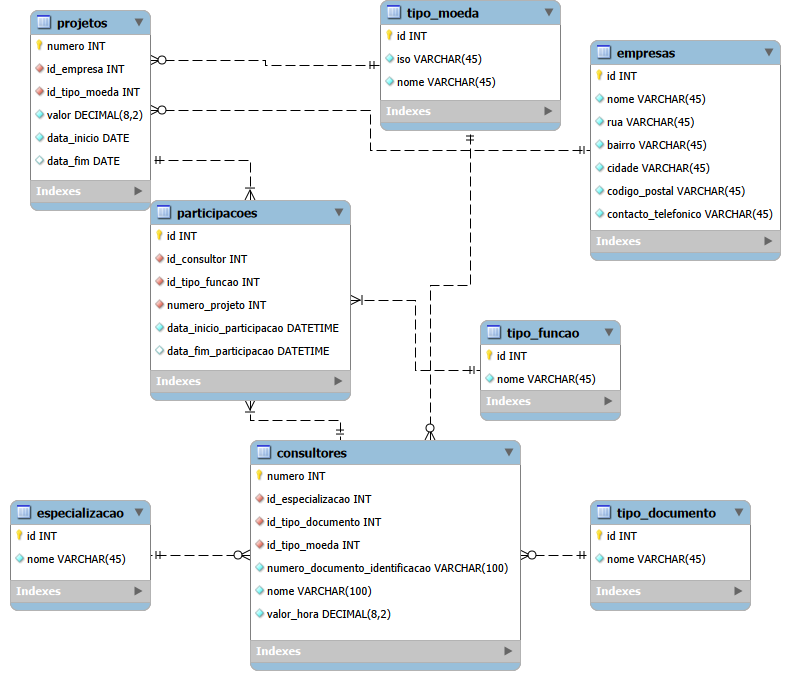

# Consultancy Project Management System - Database Modeling 🚀

This repository contains the database schema and architectural design for a **Consultancy Project Management System**. The project was designed with a focus on scalability, internationalization, and professional data integrity standards.

📺 **[Watch the full technical walkthrough on YouTube](https://www.youtube.com/watch?v=WEJOiFnjwFc)** (Portuguese with technical English terminology).

---

## 🧠 The Approach: Problem Solving & Scalability

Instead of just creating tables, this project follows a **Senior Engineering Mindset**. The requirements were deconstructed using a "Divide and Conquer" strategy:
1. **Requirement Filtering:** Stripping away noise to identify core business entities.
2. **Decomposition:** Breaking complex strings into atomic data points (1st Normal Form).
3. **Generalization:** Designing for growth (e.g., supporting multiple currencies and international document types).

## 🛠️ Key Architectural Decisions

### 1. Internationalization
* **Currency Management:** Instead of a simple decimal field, I implemented a `CurrencyType` table following **ISO standards**. This allows the system to handle projects in EUR, USD, BRL, etc., facilitating exchange rate integrations.
* **Identity Documents:** To support a global workforce (e.g., consultants in Portugal, India, or the USA), the model includes a dynamic `DocumentType` table.

### 2. Scalability & Flexibility
* **Role Management:** Roles like "Leader" or "Member" are not hardcoded. A dedicated `RoleType` table allows the business to add new positions (e.g., "Senior Auditor", "Junior Developer") without database refactoring.
* **Consultant Specializations:** A Many-to-Many relationship approach was considered to allow consultants to evolve and hold multiple expertise areas over time.

### 3. Data Integrity & Reporting
* **Participation Logic:** The relationship between Consultants and Projects is managed via a `Participation` entity. This tracks exact work hours and specific roles within each project, enabling precise billing and performance reporting.
* **Address Normalization:** Applied the **1st Normal Form (1NF)** to addresses (Street, City, ZIP, etc.) to allow for Business Intelligence (BI) filtering by region or city.

## 📊 Database Diagram (ERD)

*Note: The model was developed using MySQL Workbench.*

## 📂 Repository Structure
* `/model`: Contains the `.mwb` (MySQL Workbench) source file and high-resolution ER diagram.
* `/sql`: Contains the `DDL` script to generate the database schema.

## 🚀 About the Author
Developed by **André Teixeira**, a software developer focused on building scalable systems and sharing technical knowledge.

🔗 **Connect with me:**
* [LinkedIn](https://www.linkedin.com/in/andreteixeira2002)
* [YouTube - Programando com Andre](https://www.youtube.com/@programandocomandre3446)
* [Blog](https://programandocomandre.blogspot.pt)

---
"Good database design is not just about storing data; it's about reflecting the business's future."